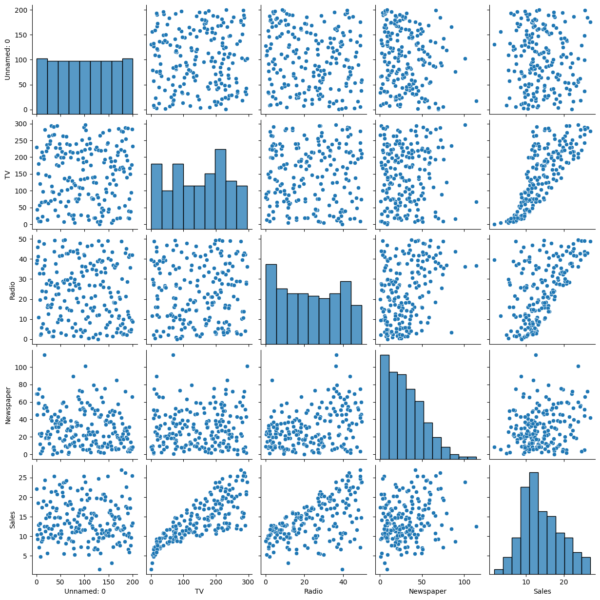
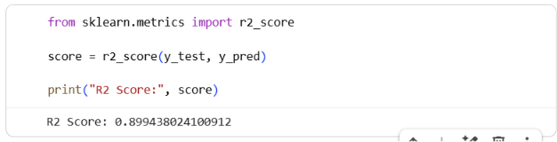
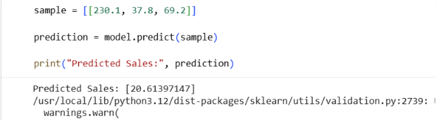

# CodeAlpha_Sales_Prediction
# Sales Prediction using Python

This project predicts product sales using Machine Learning.

## Technologies Used
- Python
- Pandas
- Scikit-learn
- Matplotlib
- Seaborn

## Model Used
- Linear Regression

## Output Screenshots

### Pair Plot

### Accuracy Output

### Prediction Output

